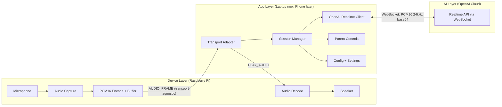
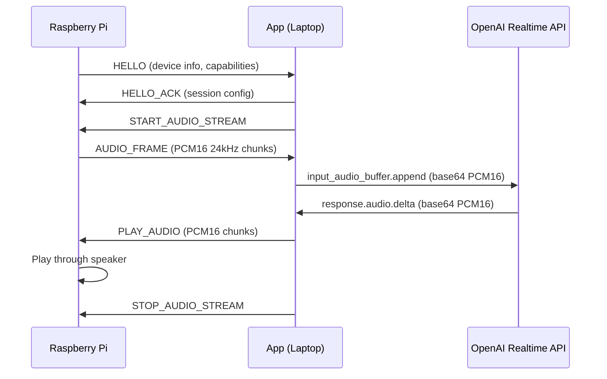
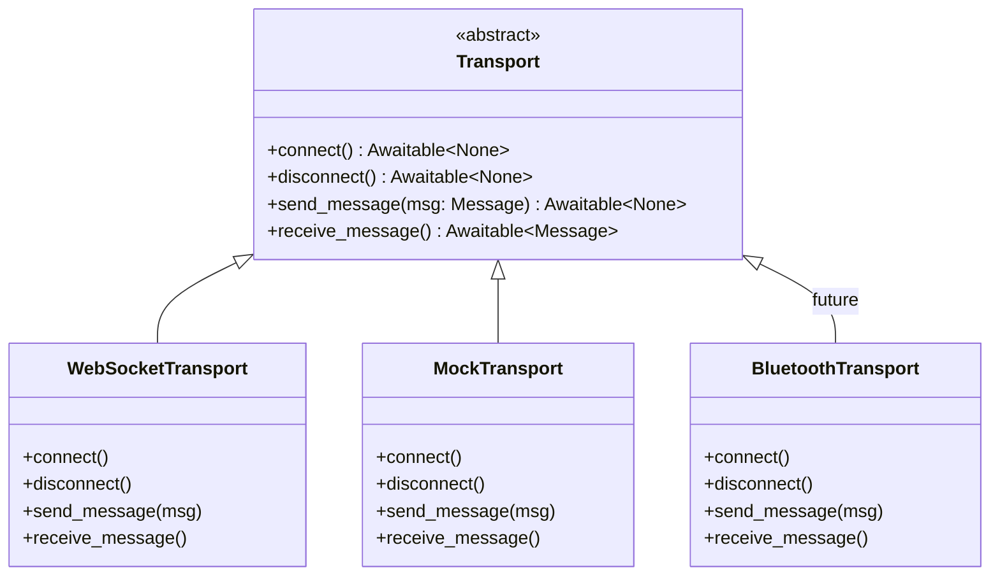

# System Architecture

This document describes the architecture of the **voice-assistant-app**, the laptop (and eventually phone) application that connects a Raspberry Pi kid's device to the OpenAI Realtime API. It covers the system layers, component responsibilities, audio and control flows, transport abstraction, design constraints, and technology choices.

---

## System Overview

The system has three logical layers that communicate in a pipeline:

| Layer | Runs on | Responsibility |
|-------|---------|----------------|
| **Device Layer** | Raspberry Pi (5 or Zero 2 W) | Captures microphone audio, plays speaker audio |
| **App Layer** | Laptop (MVP), phone (future) | Orchestrates sessions, manages AI connection, enforces parent controls |
| **AI Layer** | OpenAI Cloud | Provides conversational intelligence via the Realtime API |



### Why this split?

The Pi device is intentionally "dumb." It captures microphone audio, encodes it as raw PCM frames, and sends them to the app. It receives audio frames back and plays them through its speaker. That is the full extent of its responsibility.

This design yields several important properties:

- **No API keys on the device.** The Pi never touches OpenAI credentials.
- **No heavy compute on the device.** The Pi does not run speech models, manage sessions, or make API calls. This saves power and RAM, especially on the Pi Zero 2 W (512 MB RAM).
- **The app owns all intelligence.** Conversation state, safety filters, parent controls, and API management all live in the app.
- **The device is replaceable.** Any device that can capture audio and speak the protocol can act as a voice assistant device. The architecture is future-proof.

---

## What Runs Where

| Component | Runs on | Rationale |
|-----------|---------|-----------|
| Audio capture + playback | Raspberry Pi (or mock on laptop) | Device responsibility |
| Transport server (WebSocket) | Laptop | Accepts connections from Pi |
| Session manager | Laptop | Orchestrates device + AI sessions |
| OpenAI Realtime client | Laptop | Manages WebSocket to OpenAI |
| Parent controls / config | Laptop | Settings, permissions, safety |
| CLI (Phase 1) / Web UI (Phase 6+) | Laptop | Control panel for testing and monitoring |

---

## Audio Flow

The app acts as a relay between the Pi and OpenAI. Audio captured on the Pi flows through the app to the Realtime API, and AI-generated audio flows back through the app to the Pi's speaker.



### Audio format

The entire pipeline standardizes on **24 kHz, PCM16, mono, little-endian**. This is the exact format the OpenAI Realtime API expects. By capturing audio in this format on the Pi, the app can forward frames directly to OpenAI without resampling or conversion, minimizing latency and CPU usage on both sides.

Audio data is base64-encoded inside JSON messages. This follows the same pattern OpenAI uses in their API, keeping the protocol simple, consistent, and fully debuggable as text.

---

## Control Flow

### Starting a session

1. Parent opens the app and sees device status (online/offline/battery level).
2. Parent initiates "Start Session" -- the app sends `START_AUDIO_STREAM` to the Pi.
3. The Pi begins capturing microphone audio and streaming `AUDIO_FRAME` messages to the app.
4. The app opens a WebSocket connection to the OpenAI Realtime API and forwards audio frames.
5. OpenAI responds with audio deltas; the app wraps them in `PLAY_AUDIO` messages and sends them to the Pi.
6. The Pi plays the AI response through its speaker.

### Stopping a session

1. Parent initiates "Stop Session" -- the app sends `STOP_AUDIO_STREAM` to the Pi.
2. The Pi stops microphone capture and ceases sending `AUDIO_FRAME` messages.
3. The app closes the OpenAI WebSocket connection.

---

## Connection to OpenAI Realtime API

The app connects to the OpenAI Realtime API at `wss://api.openai.com/v1/realtime` using a standard WebSocket connection.

- **Authentication:** The API key is sent as a header during the WebSocket handshake. The key is stored in the app's `.env` file and never exposed to the device.
- **Audio format:** 24 kHz PCM16 mono, base64-encoded within JSON messages.
- **Upstream (app to OpenAI):** The app sends `input_audio_buffer.append` events containing base64 audio frames captured from the Pi.
- **Downstream (OpenAI to app):** The API sends `response.audio.delta` events containing base64 audio of the AI's spoken response.
- **Session lifecycle:** The app creates a session, configures voice and system instructions (including kid-safety guardrails), streams audio bidirectionally, and handles interruptions (user speaking while the AI is still responding).

---

## Transport Abstraction

The transport layer is designed to be pluggable. A `Transport` abstract base class defines the interface; concrete implementations handle the specifics of each communication channel.



### Current implementations

- **`WebSocketTransport`** -- The laptop runs a WebSocket server over the local Wi-Fi network. The Pi connects as a client. WebSocket is bidirectional, full-duplex, and low-overhead (2-14 bytes per frame header), making it well-suited for streaming audio in both directions.
- **`MockTransport`** -- Simulates a device for testing without hardware. Generates fake `HELLO`, `DEVICE_STATUS`, and `AUDIO_FRAME` messages so that the session manager and protocol logic can be fully tested on the laptop alone.

### Future implementations

- **`BluetoothTransport`** -- A Bluetooth implementation using either Classic SPP or BLE. The transport interface remains identical; only the underlying communication channel changes. The session manager never knows or cares which transport is active.

### Why WebSocket first?

- Bidirectional, full-duplex -- ideal for streaming audio in both directions.
- Low per-message overhead compared to HTTP.
- Well-supported in Python via the `websockets` library.
- Same library used to connect to OpenAI's Realtime API, reducing dependency count.
- Easy to test locally before hardware is ready.

---

## Design Constraints

1. **Pi does minimal compute.** Capture mic audio, encode PCM16, send frames, receive frames, play audio. No AI inference, no API calls, no complex state management.

2. **App owns the API key.** The OpenAI API key never leaves the app. The Pi has no knowledge of OpenAI.

3. **Works with both Pi models.** The protocol and transport are device-agnostic. The Pi 5 (more powerful) and the Pi Zero 2 W (resource-constrained) both speak the same protocol.

4. **Mock-first development.** Every component has a mock variant for development and testing without hardware. `MockTransport` simulates a device; a future `MockRealtimeClient` can simulate OpenAI responses.

5. **Transport-agnostic design.** The `Transport` abstract class decouples session logic from the communication channel. Switching from Wi-Fi WebSocket to Bluetooth means implementing one new class, not rewriting the app.

6. **Kid-safe by architecture.** The app controls what the AI can say (via system instructions), when the device is active (via session controls), and what topics are allowed (via parent settings). The kid's device has no way to bypass these controls because it never interacts with the AI directly.

7. **Power-efficiency-aware.** The Pi only runs its microphone and speaker when the app sends `START_AUDIO_STREAM`. Heartbeats (`DEVICE_STATUS`) are infrequent (every 30 seconds). The protocol supports `SHUTDOWN_DEVICE` for remote power management.

---

## Tech Stack

### Language: Python 3.11+

Python was chosen for several reasons:

- Raspberry Pi ecosystem is Python-first (GPIO, audio libraries, system tools).
- OpenAI's Realtime API examples and SDK are Python-native.
- `asyncio` provides excellent async I/O for handling multiple WebSocket connections concurrently without threads.
- Fast iteration with no compile step, rich REPL, and straightforward debugging.

### Key Libraries

| Library | Purpose |
|---------|---------|
| `websockets` | WebSocket server (Pi-to-App) and client (App-to-OpenAI) |
| `asyncio` | Built-in async framework for concurrent audio stream handling |
| `pydantic` | Data validation for protocol messages; catches structural bugs early |
| `python-dotenv` | Loads `.env` files for API keys and configuration |
| `structlog` | Structured logging, far more useful than `print()` for debugging async systems |
| `pytest` + `pytest-asyncio` | Testing framework with native async support |

### Why JSON messages (not raw binary)?

Protocol messages are JSON objects with base64-encoded audio payloads. This approach prioritizes:

- **Debuggability:** Every message can be printed and read during development.
- **Consistency:** OpenAI's Realtime API uses JSON with base64 audio, so the app is already handling this format.
- **Simplicity:** No custom binary parser is needed.
- **Acceptable overhead:** The ~33% size increase from base64 encoding is negligible over Wi-Fi. For Bluetooth, raw binary frames can be used as a transport-level optimization without changing protocol semantics.

### CLI-first UI (Phase 1)

The MVP uses a command-line interface. This eliminates frontend complexity and allows full focus on the core architecture. A web UI (FastAPI + HTML dashboard) is planned for Phase 6. The eventual phone app (Phase 8+) will likely use React Native or Flutter, but the core Python package is designed to be wrappable by a mobile backend or re-implementable in another language. The protocol itself is language-agnostic (JSON over WebSocket).

---

## Project Structure

```
voice-assistant-app/
├── src/
│   └── voice_assistant/
│       ├── __init__.py
│       ├── main.py                    # CLI entrypoint
│       ├── config.py                  # Configuration loading (.env, defaults)
│       ├── core/
│       │   ├── __init__.py
│       │   ├── session.py             # Session manager (orchestrates device + AI)
│       │   └── message.py             # Protocol message types (Pydantic models)
│       ├── transport/
│       │   ├── __init__.py
│       │   ├── base.py                # Abstract Transport interface
│       │   ├── websocket_transport.py # WebSocket implementation
│       │   └── mock_transport.py      # Mock for testing without hardware
│       ├── openai_client/
│       │   ├── __init__.py
│       │   └── realtime.py            # OpenAI Realtime API WebSocket client
│       └── audio/
│           ├── __init__.py
│           └── utils.py               # Audio format helpers
├── tests/
├── docs/
├── pyproject.toml
├── requirements.txt
└── .env.example
```

### Structure rationale

- **`src/voice_assistant/`** uses the modern Python `src` layout to prevent accidental imports from the project root.
- **`core/`** contains business logic independent of any specific transport or API.
- **`transport/`** holds all transport implementations behind the abstract interface. Adding Bluetooth means adding one file here.
- **`openai_client/`** isolates OpenAI interaction. If the API changes, only this folder is affected.
- **`audio/`** provides audio format conversion utilities shared by both the transport layer and the OpenAI client.
