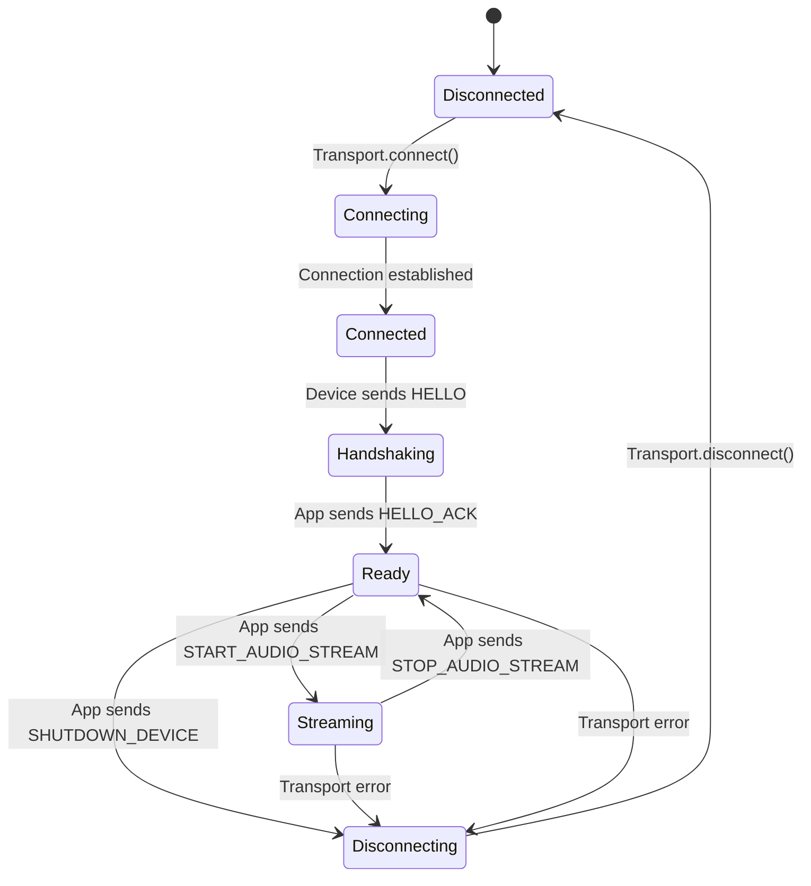

# Device-App Protocol Specification

This document defines the communication protocol between the Raspberry Pi device and the voice-assistant-app. The protocol is transport-agnostic: it works identically over WebSocket, Bluetooth, or any future transport that supports bidirectional message exchange.

---

## Overview

- All messages are **JSON objects** sent over the active transport.
- Every message has a required **`type`** field (string), an optional **`payload`** field (object), and an optional **`timestamp`** field (ISO 8601 string).
- Binary audio data is **base64-encoded** inside the JSON payload, following the same pattern used by the OpenAI Realtime API.
- Messages are newline-delimited when logged but are discrete units on the transport (one JSON object per WebSocket frame, for example).

### Why JSON?

- **Debuggable.** Every message can be printed, read, and inspected during development.
- **Consistent.** The OpenAI Realtime API uses JSON with base64 audio, so the app already handles this format on the AI side.
- **Simple.** No custom binary parser is required.
- **Transport-friendly.** JSON works equally well over WebSocket text frames, Bluetooth serial streams, or any other channel.

The ~33% size overhead of base64 encoding is acceptable over Wi-Fi. For bandwidth-constrained transports like BLE, raw binary framing can be introduced as a transport-level optimization without changing the protocol semantics.

---

## Message Format

```json
{
  "type": "MESSAGE_TYPE",
  "payload": { },
  "timestamp": "2026-06-30T15:30:00.123Z"
}
```

| Field | Type | Required | Description |
|-------|------|----------|-------------|
| `type` | string | Yes | Identifies the message type. One of the values defined below. |
| `payload` | object | No | Type-specific data. Some message types have an empty or absent payload. |
| `timestamp` | string (ISO 8601) | No | When the message was created. Useful for latency measurement and debugging. |

---

## Message Types

### Device to App

#### `HELLO`

Sent by the device immediately after connecting. Announces the device and its capabilities.

**Payload:**

| Field | Type | Description |
|-------|------|-------------|
| `device_id` | string | Unique identifier for the device |
| `device_type` | string | `"pi5"` or `"pi_zero_2w"` |
| `firmware_version` | string | Firmware/software version on the device |
| `capabilities` | string[] | List of supported features (e.g., `["audio_capture", "audio_playback"]`) |

**Example:**

```json
{
  "type": "HELLO",
  "payload": {
    "device_id": "pi5-kitchen-01",
    "device_type": "pi5",
    "firmware_version": "0.1.0",
    "capabilities": ["audio_capture", "audio_playback"]
  },
  "timestamp": "2026-06-30T15:00:00.000Z"
}
```

---

#### `DEVICE_STATUS`

Periodic heartbeat with device health information. Sent approximately every 30 seconds.

**Payload:**

| Field | Type | Description |
|-------|------|-------------|
| `battery_percent` | number or null | Battery level (0-100), null if plugged in |
| `cpu_temp` | number | CPU temperature in Celsius |
| `is_recording` | boolean | Whether the device is currently capturing audio |
| `uptime_seconds` | number | Seconds since device boot |

**Example:**

```json
{
  "type": "DEVICE_STATUS",
  "payload": {
    "battery_percent": null,
    "cpu_temp": 52.3,
    "is_recording": true,
    "uptime_seconds": 3600
  },
  "timestamp": "2026-06-30T15:01:00.000Z"
}
```

---

#### `AUDIO_FRAME`

A chunk of captured microphone audio. Sent continuously while the device is recording.

**Payload:**

| Field | Type | Description |
|-------|------|-------------|
| `audio` | string | Base64-encoded PCM16 audio data (24 kHz, mono, little-endian) |
| `sequence_number` | integer | Monotonically increasing frame counter for ordering and gap detection |
| `timestamp` | string (ISO 8601) | Capture timestamp on the device |

**Example:**

```json
{
  "type": "AUDIO_FRAME",
  "payload": {
    "audio": "SGVsbG8gV29ybGQ=",
    "sequence_number": 42,
    "timestamp": "2026-06-30T15:30:00.123Z"
  },
  "timestamp": "2026-06-30T15:30:00.123Z"
}
```

---

#### `CALIBRATION_STATUS`

Sent by the device during the calibration phase to report which step it is on. Used only to drive UI feedback; the app takes no control action on it.

**Payload:**

| Field | Type | Description |
|-------|------|-------------|
| `phase` | string | Current calibration phase, e.g. `"quiet"`, `"prompt"`, `"speak"` |

**Example:**

```json
{
  "type": "CALIBRATION_STATUS",
  "payload": { "phase": "speak" },
  "timestamp": "2026-06-30T15:00:03.000Z"
}
```

---

#### `CALIBRATION_COMPLETE`

Sent by the device **only after it has captured a genuine user "hello"** in response to the "say hello to start" prompt. This message is the gate that ends calibration and lets the app start the assistant, so its correctness is critical (see [Calibration Flow](#calibration-flow)).

**Payload:**

| Field | Type | Description |
|-------|------|-------------|
| `speech_detected` | boolean | **Must be `true` only when the device actually heard the user speak.** The device must not report `true` for its own "say hello to start" prompt bleeding into the mic, or for ambient room noise. If it is `false`, the app rejects calibration and the device should re-prompt. |
| `noise_floor` | number | Ambient RMS level measured during the quiet phase. |
| `user_speech_peak` | number | Peak RMS level measured while the user spoke. The app requires `user_speech_peak - noise_floor >= 80`, otherwise it rejects calibration as "too quiet". |

The app derives OpenAI voice-activity-detection settings from `noise_floor` and `user_speech_peak`, then caches them so a later resume can skip re-calibration.

**Example:**

```json
{
  "type": "CALIBRATION_COMPLETE",
  "payload": {
    "speech_detected": true,
    "noise_floor": 320.0,
    "user_speech_peak": 910.0
  },
  "timestamp": "2026-06-30T15:00:05.000Z"
}
```

---

#### `PLAYBACK_COMPLETE`

Sent by the device after it finishes playing a `PLAY_AUDIO` chunk marked `is_final: true`. The app uses this to unmute the microphone only after speaker output has fully drained.

**Payload:**

| Field | Type | Description |
|-------|------|-------------|
| `sequence_number` | integer | Matches the `sequence_number` from the final `PLAY_AUDIO` message |
| `duration_ms` | integer | Total playback time including a short post-playback recovery buffer |

**Example:**

```json
{
  "type": "PLAYBACK_COMPLETE",
  "payload": {
    "sequence_number": 1,
    "duration_ms": 3250
  },
  "timestamp": "2026-06-30T15:30:03.500Z"
}
```

---

#### `ERROR`

Reports a device-side error to the app.

**Payload:**

| Field | Type | Description |
|-------|------|-------------|
| `code` | string | Machine-readable error code (see [Error Codes](#error-codes)) |
| `message` | string | Human-readable error description |
| `recoverable` | boolean | Whether the device can continue operating after this error |

**Example:**

```json
{
  "type": "ERROR",
  "payload": {
    "code": "MIC_UNAVAILABLE",
    "message": "Microphone device not found or access denied",
    "recoverable": false
  },
  "timestamp": "2026-06-30T15:30:05.000Z"
}
```

---

### App to Device

#### `HELLO_ACK`

Acknowledges the device's `HELLO` message and provides session configuration.

**Payload:**

| Field | Type | Description |
|-------|------|-------------|
| `session_id` | string | Unique identifier for this session |
| `audio_config` | object | Audio format the device should use |
| `audio_config.sample_rate` | integer | Sample rate in Hz (always `24000`) |
| `audio_config.format` | string | Audio format (always `"pcm16"`) |
| `audio_config.channels` | integer | Number of audio channels (always `1`) |

**Example:**

```json
{
  "type": "HELLO_ACK",
  "payload": {
    "session_id": "sess_abc123",
    "audio_config": {
      "sample_rate": 24000,
      "format": "pcm16",
      "channels": 1
    }
  },
  "timestamp": "2026-06-30T15:00:00.050Z"
}
```

---

#### `START_AUDIO_STREAM`

Instructs the device to begin capturing microphone audio and streaming `AUDIO_FRAME` messages.

**Payload:**

| Field | Type | Description |
|-------|------|-------------|
| `skip_calibration` | boolean (optional) | When `true`, the device **must skip the calibration phase entirely** — do not play "say hello to start", do not re-measure levels — and begin streaming immediately. Sent by the app when resuming a paused session, where calibration levels are already known. When absent or `false`, the device runs its normal calibration flow before streaming. |

A fresh session start sends no payload (calibrate). A **resume** sends `{"skip_calibration": true}` (do not calibrate again).

**Example (resume — skip calibration):**

```json
{
  "type": "START_AUDIO_STREAM",
  "payload": { "skip_calibration": true },
  "timestamp": "2026-06-30T15:00:01.000Z"
}
```

---

#### `STOP_AUDIO_STREAM`

Instructs the device to stop capturing microphone audio.

**Payload:** Empty or absent.

**Example:**

```json
{
  "type": "STOP_AUDIO_STREAM",
  "payload": {},
  "timestamp": "2026-06-30T15:05:00.000Z"
}
```

---

#### `PLAY_AUDIO`

Sends audio data for the device to play through its speaker. Typically contains AI-generated speech relayed from the OpenAI Realtime API.

**Payload:**

| Field | Type | Description |
|-------|------|-------------|
| `audio` | string | Base64-encoded PCM16 audio data (24 kHz, mono, little-endian) |
| `sequence_number` | integer | Monotonically increasing frame counter for ordering |
| `is_final` | boolean | When `true`, this is the complete AI response; device should drain playback and send `PLAYBACK_COMPLETE` |
| `duration_ms` | integer (optional) | Estimated playback duration; informational for logging |

**Example:**

```json
{
  "type": "PLAY_AUDIO",
  "payload": {
    "audio": "AQACAAMABAAFAAQA...",
    "sequence_number": 1,
    "is_final": true,
    "duration_ms": 2950
  },
  "timestamp": "2026-06-30T15:30:01.200Z"
}
```

---

#### `MUTE_MIC`

Instructs the device to stop sending `AUDIO_FRAME` messages while the AI is speaking. The device should keep `arecord` running but discard captured frames.

**Payload:** Empty or absent.

---

#### `UNMUTE_MIC`

Instructs the device to resume sending `AUDIO_FRAME` messages. Sent by the app only after `PLAYBACK_COMPLETE` (or a safety timeout).

**Payload:** Empty or absent.

---

#### `SET_VOLUME`

Adjusts the device's speaker volume.

**Payload:**

| Field | Type | Description |
|-------|------|-------------|
| `volume` | integer | Volume level from 0 (mute) to 100 (maximum) |

**Example:**

```json
{
  "type": "SET_VOLUME",
  "payload": {
    "volume": 75
  },
  "timestamp": "2026-06-30T15:00:02.000Z"
}
```

---

#### `SHUTDOWN_DEVICE`

Instructs the device to safely power off.

**Payload:** Empty or absent.

**Example:**

```json
{
  "type": "SHUTDOWN_DEVICE",
  "payload": {},
  "timestamp": "2026-06-30T16:00:00.000Z"
}
```

---

### Bidirectional

#### `PING`

Keepalive message. Either side can send a `PING`; the other side must respond with a `PONG`.

**Payload:**

| Field | Type | Description |
|-------|------|-------------|
| `timestamp` | string (ISO 8601) | When the ping was sent, for round-trip latency measurement |

**Example:**

```json
{
  "type": "PING",
  "payload": {
    "timestamp": "2026-06-30T15:30:00.000Z"
  },
  "timestamp": "2026-06-30T15:30:00.000Z"
}
```

---

#### `PONG`

Response to a `PING`. Must include the original ping timestamp for latency calculation.

**Payload:**

| Field | Type | Description |
|-------|------|-------------|
| `timestamp` | string (ISO 8601) | The timestamp from the original `PING` message |

**Example:**

```json
{
  "type": "PONG",
  "payload": {
    "timestamp": "2026-06-30T15:30:00.000Z"
  },
  "timestamp": "2026-06-30T15:30:00.005Z"
}
```

---

## Audio Format Specification

All audio data in the protocol uses a single standardized format:

| Parameter | Value |
|-----------|-------|
| Sample rate | 24,000 Hz (24 kHz) |
| Bit depth | 16-bit signed integer (PCM16) |
| Channels | 1 (mono) |
| Byte order | Little-endian |
| Encoding in messages | Base64 |

### Rationale

This format matches the OpenAI Realtime API's expected input and output format exactly. By capturing audio on the Pi in this format, the app can forward frames directly to OpenAI without resampling or conversion, minimizing latency and CPU overhead.

### Frame sizing

A typical audio frame contains 20-100 ms of audio:

| Duration | Samples | Raw bytes | Base64 bytes (approx.) |
|----------|---------|-----------|----------------------|
| 20 ms | 480 | 960 | 1,280 |
| 50 ms | 1,200 | 2,400 | 3,200 |
| 100 ms | 2,400 | 4,800 | 6,400 |

Smaller frames reduce latency but increase per-frame overhead. The recommended default is 20-50 ms frames, tunable based on network conditions.

---

## Error Codes

Device-side errors use string codes in the `ERROR` message's `code` field.

| Code | Description | Recoverable |
|------|-------------|-------------|
| `MIC_UNAVAILABLE` | Microphone hardware not found or inaccessible | No |
| `MIC_ERROR` | Microphone error during capture (e.g., buffer overrun) | Yes |
| `SPEAKER_UNAVAILABLE` | Speaker hardware not found or inaccessible | No |
| `SPEAKER_ERROR` | Speaker error during playback | Yes |
| `AUDIO_FORMAT_ERROR` | Received audio in an unsupported format | Yes |
| `TRANSPORT_ERROR` | Transport-level communication failure | Depends on cause |
| `LOW_BATTERY` | Battery level critically low | Yes (can continue briefly) |
| `OVERTEMP` | CPU temperature exceeds safe threshold | Yes (device may throttle) |
| `UNKNOWN` | Unclassified error | Depends on cause |

### Error handling behavior

- **Recoverable errors:** The app should log the error and continue the session. The device remains connected and operational.
- **Non-recoverable errors:** The app should log the error, notify the parent, and expect the device to disconnect or require a restart.
- **Repeated errors:** If the same error occurs multiple times in succession, the app should consider stopping the session and alerting the parent.

---

## Connection Lifecycle



---

## Calibration Flow

When the app sends `START_AUDIO_STREAM` **without** `skip_calibration`, the device runs a one-time calibration before real conversation audio flows. Its purpose is twofold: measure ambient noise vs. the user's voice level (so the app can tune voice-activity detection), and confirm a real person is present before the assistant starts talking.

```mermaid
sequenceDiagram
  participant App
  participant Pi as Raspberry Pi

  App->>Pi: START_AUDIO_STREAM (no skip_calibration)
  Pi->>Pi: Measure quiet ambient level
  Pi->>App: CALIBRATION_STATUS (phase: quiet)
  Pi->>Pi: Play "say hello to start"
  Pi->>App: CALIBRATION_STATUS (phase: speak)
  Pi->>Pi: Wait for a REAL user "hello"
  Note over Pi: Repeat the prompt if silent;<br/>do NOT count the prompt's own<br/>playback or room noise as speech
  Pi->>App: CALIBRATION_COMPLETE (speech_detected: true, levels)
  App->>Pi: (assistant greeting begins)
```

### Device requirements (must-implement)

These two rules are the contract the app relies on. Violating them produces the two most common calibration bugs:

1. **Only report a genuine hello.** `CALIBRATION_COMPLETE` must be sent with `speech_detected: true` **only** when the microphone actually captured the user speaking. The device must not let its own "say hello to start" prompt (played through the speaker and bleeding into the mic) or ambient noise count as speech. If the device cannot confirm real speech, it should keep waiting / re-prompting rather than completing.
   *Symptom when violated: the assistant greets even though the user stayed silent.*

2. **Honor `skip_calibration`.** When `START_AUDIO_STREAM` arrives with `{"skip_calibration": true}`, the device must **not** re-run calibration — no "say hello to start" prompt, no re-measuring — and must begin streaming immediately. The app sends this on **resume**, where levels are already known.
   *Symptom when violated: resuming a paused session replays "say hello to start" and re-calibrates.*

### App behaviour (already implemented)

- On a fresh start the app sends `START_AUDIO_STREAM` with no payload; on resume it sends `{"skip_calibration": true}`.
- The app rejects calibration (and waits for a retry) if `speech_detected` is `false` or if `user_speech_peak - noise_floor < 80`.
- While waiting for the hello, the app re-prompts about every 60 seconds and abandons the session after 5 minutes of silence.

---

## Future Extensibility

The protocol is designed to evolve without breaking backward compatibility:

- **New message types** can be added freely. Devices and apps should ignore message types they do not recognize.
- **New payload fields** can be added to existing message types. Consumers should ignore fields they do not recognize.
- **Version negotiation** can be added to the `HELLO`/`HELLO_ACK` exchange if breaking changes become necessary (e.g., adding a `protocol_version` field to the `HELLO` payload).
- **Binary transport optimization.** For bandwidth-constrained transports like BLE, a binary framing layer can be introduced at the transport level, encoding the same logical messages without base64 overhead. The protocol semantics remain unchanged.
- **Additional device types.** The `device_type` field in `HELLO` can accommodate new hardware platforms beyond Pi 5 and Pi Zero 2 W.
- **Extended capabilities.** The `capabilities` array in `HELLO` enables feature negotiation. New capabilities (e.g., `"camera"`, `"led_control"`, `"sensors"`) can be declared by future device firmware without protocol changes.
