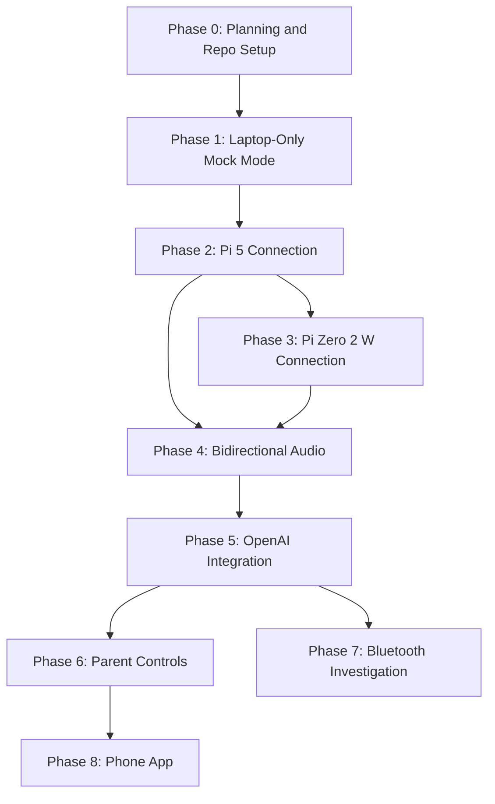

# Development Roadmap

This document outlines the phased development plan for the voice-assistant-app, from initial scaffolding through to the eventual phone app. Each phase builds on the previous one and has clear success criteria.

---

## Current Status

| Phase | Name | Status |
|-------|------|--------|
| 0 | Planning and Repo Setup | Complete |
| 1 | Laptop-Only Mock Mode | **In Progress** |
| 2 | Pi 5 Connection (Local Network) | Pending |
| 3 | Pi Zero 2 W Connection (Local Network) | Pending |
| 4 | Real Bidirectional Audio Streaming | Pending |
| 5 | OpenAI Realtime API Integration | Pending |
| 6 | Parent Control Features | Pending |
| 7 | Bluetooth Investigation | Pending |
| 8 | Phone App Migration | Pending |

---

## Phase 0: Planning and Repo Setup

Initialize the project foundation so that anyone can clone the repo, read the docs, and understand the project.

**Deliverables:**
- Git repository initialized with `.gitignore`.
- `README.md` with project overview and setup instructions.
- `docs/architecture.md`, `docs/protocol.md`, `docs/roadmap.md`.
- `pyproject.toml` and `requirements.txt` with dependencies.
- `.env.example` with placeholder configuration.
- Folder structure under `src/voice_assistant/` with `__init__.py` files.

**Success criteria:** A developer can clone the repo, read the documentation, and understand the full system architecture, protocol, and development plan.

**Status:** Complete.

---

## Phase 1: Laptop-Only Mock Mode

Build the core application logic using a mock transport that simulates a Pi device. This validates the architecture without requiring any hardware or API keys.

**Deliverables:**
- Pydantic message models for all protocol message types (`core/message.py`).
- Abstract `Transport` class defining the transport interface (`transport/base.py`).
- `MockTransport` that simulates a fake device sending `HELLO`, `DEVICE_STATUS`, and `AUDIO_FRAME` messages (`transport/mock_transport.py`).
- `SessionManager` that orchestrates device and AI sessions (`core/session.py`).
- Configuration loader for `.env` and defaults (`config.py`).
- CLI entrypoint with `--mock` flag (`main.py`).
- Unit tests covering message types, session lifecycle, and mock transport.

**Success criteria:**
1. `python -m voice_assistant --mock` starts a simulated session with logged message exchanges.
2. The mock device sends `HELLO`; the app responds with `HELLO_ACK`.
3. The app sends `START_AUDIO_STREAM`; the mock device starts sending fake `AUDIO_FRAME` messages.
4. The app sends `STOP_AUDIO_STREAM`; the mock device stops sending frames.
5. All protocol messages are validated by Pydantic models.
6. `pytest` passes with at least 5 test cases.

**Dependencies:** Phase 0.

**Status:** In progress.

---

## Phase 2: Pi 5 Connection (Local Network)

Connect the app to a real Raspberry Pi 5 over the local Wi-Fi network using WebSocket.

**Deliverables:**
- `WebSocketTransport` server implementation on the laptop.
- Minimal WebSocket client script for the Pi 5 (in the `voice-assistant-pi5` repo).
- Connection test: laptop discovers Pi, exchanges `HELLO` / `HELLO_ACK` / `DEVICE_STATUS` messages.

**Success criteria:** The laptop and Pi 5 establish a WebSocket connection and exchange control messages over Wi-Fi.

**Dependencies:** Phase 1.

---

## Phase 3: Pi Zero 2 W Connection (Local Network)

Validate that the same protocol and transport work on the more resource-constrained Pi Zero 2 W.

**Deliverables:**
- Same WebSocket client running on Pi Zero 2 W.
- Performance profiling: memory and CPU usage on the Pi Zero 2 W.
- Confirmation that the protocol works identically across both Pi models.

**Success criteria:** Both Pi models work with the same app and same protocol. Memory and CPU usage on the Pi Zero 2 W remain within acceptable limits (well under 512 MB RAM, minimal CPU overhead).

**Dependencies:** Phase 2.

---

## Phase 4: Real Bidirectional Audio Streaming

Stream real microphone audio from the Pi through the app and back to the Pi's speaker (loopback test).

**Deliverables:**
- Pi captures real microphone audio as PCM16 24 kHz mono.
- Pi sends `AUDIO_FRAME` messages to the laptop over WebSocket.
- Laptop receives frames and can play them locally (loopback verification).
- Laptop sends `PLAY_AUDIO` frames back to the Pi; Pi plays through speaker.
- Basic buffering, jitter handling, and error recovery.

**Success criteria:** Speak into the Pi's microphone and hear your voice played back through the Pi's speaker, relayed via the laptop. Round-trip latency is measured and documented.

**Dependencies:** Phase 2 or Phase 3 (either Pi model).

---

## Phase 5: OpenAI Realtime API Integration

Wire up the OpenAI Realtime API so that Pi audio reaches the AI and AI responses play through the Pi.

**Deliverables:**
- `RealtimeClient` that connects to `wss://api.openai.com/v1/realtime`.
- Full audio pipeline: Pi mic -> App -> OpenAI -> App -> Pi speaker.
- Session lifecycle management: create session, configure voice and system instructions, stream audio, receive responses.
- Interruption handling: user speaks while the AI is still responding.
- Reconnection logic and exponential backoff for API errors.

**Success criteria:** Speak into the Pi's microphone and hear the AI's response through the Pi's speaker. The conversation feels natural with acceptable latency.

**Dependencies:** Phase 4.

---

## Phase 6: Parent Control Features

Add controls that let a parent manage and monitor the assistant.

**Deliverables:**
- Session time limits and usage tracking.
- Content and topic restrictions via system instructions.
- On/off scheduling (bedtime mode).
- Simple web dashboard (FastAPI + HTML) for parent monitoring and control.

**Success criteria:** A parent can control and monitor the assistant from a browser -- starting/stopping sessions, setting time limits, viewing usage, and configuring topic restrictions.

**Dependencies:** Phase 5.

---

## Phase 7: Bluetooth Investigation

Explore Bluetooth as an alternative transport to Wi-Fi.

**Deliverables:**
- Research on Bluetooth audio profiles (A2DP, HFP, SPP) and Python BLE libraries.
- Prototype `BluetoothTransport` implementing the same `Transport` interface.
- Latency and bandwidth benchmarks compared to Wi-Fi WebSocket.

**Success criteria:** Demonstrate that Bluetooth is viable for audio streaming between the Pi and the app. Identify constraints (bandwidth limits, pairing complexity, range) and document trade-offs.

**Dependencies:** Phase 5 (working system to compare against). Can be explored in parallel with Phase 6.

---

## Phase 8: Phone App Migration

Move the app from the laptop to a phone, making it a portable parent controller.

**Deliverables:**
- Evaluation of React Native vs. Flutter for the parent app.
- Design document for phone app architecture.
- Decision on backend approach: the Python core runs as a cloud service, or is re-implemented as a mobile backend.

**Success criteria:** A design document specifying the phone app architecture, tech stack, and migration plan. The protocol remains unchanged; only the transport and UI layer change.

**Dependencies:** Phase 6.

---

## Phase Dependency Graph

---

## MVP Definition

The MVP is **Phase 1: Laptop-Only Mock Mode**. It proves the core architecture without requiring any hardware or API keys.

### What the MVP includes

- Message models validated by Pydantic.
- Transport abstraction with a mock implementation.
- Session manager that orchestrates the device lifecycle.
- CLI that runs a simulated session with full protocol message exchange logging.
- Unit tests covering messages, transport, and session lifecycle.

### What the MVP does not include

- No real audio capture or playback.
- No OpenAI API connection.
- No real Pi connection.
- No web UI.
- No parent controls.

### Why this MVP matters

It validates that the protocol design works, the transport abstraction is clean, and the session lifecycle is correct -- all before introducing the complexity of real hardware and real APIs. Every subsequent phase builds on a proven, tested foundation.
